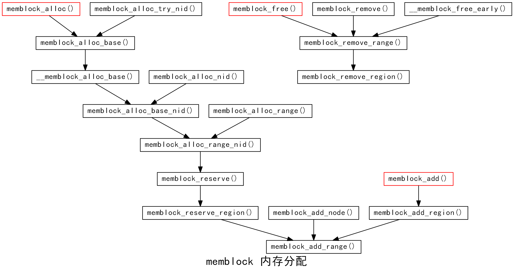

.. highlight:: rst

内存管理
========

linux OOM 机制分析
-------------------

Linux下有一种 ``OOM KILLER`` 的机制，它会在系统内存耗尽的情况下，启用自己算法有选择性的杀掉一些进程。

为什么会有OOM killer
^^^^^^^^^^^^^^^^^^^^

当我们使用应用时，需要申请内存，即进行 ``malloc`` 的操作，进行 ``malloc`` 操作如果返回一个 **非NULL** 的操作表示申请到了可用的内存。事实上，这个地方是可能存在问题的。

当我们在用户空间申请内存时，一般使用 ``malloc`` ，是不是当 ``malloc`` 返回为空时，没有可以申请的内存空间就会返回呢？答案是 **否定** 的。在 ``malloc`` 申请内存的机制中有如下一段描述 ::

        By default, Linux follows an optimistic memory allocation strategy.  
        This means that when malloc() returns non-NULL there is  no  guarantee 
        that  the  memory  really is available.  This is a really bad bug.  In 
        case it turns out that the system is out of memory, one or more processes 
        will be killed by the infamous OOM killer.  In case Linux is employed 
        under circumstances where it would be less desirable to suddenly lose 
        some randomly picked processes, and moreover the kernel version is 
        sufficiently recent, one can switch off this overcommitting behavior 
        using a command like:
        
        # echo 2  > /proc/sys/vm/overcommit_memory
        
        See also the kernel Documentation directory, files vm/overcommit-accounting
        and sysctl/vm.txt.

上面的描述中说明了在Linux中当malloc返回的是非空时，并不代表有可以使用的内存空间。Linux系统允许程序申请比系统可用内存更多的内存空间，这个特性叫做 ``overcommit`` 特性，这样做可能是为了系统的优化，因为不是所有的程序申请了内存就会立刻使用，当真正的使用时，系统可能已经回收了一些内存。但是，当你使用时Linux系统没有内存可以使用时，OOM Killer就会出来让一些进程退出。

Linux下有3种Overcommit的策略（参考内核文档： ``Documentation/vm/overcommit-accounting`` ），可以在 ``/proc/sys/vm/overcommit_memory`` 配置（可以取0,1和2三个值，默认是0）。 

*  0： **启发式策略** ，比较严重的Overcommit将不能得逞，比如你突然申请了128TB的内存。而轻微的overcommit将被允许。另外，root能Overcommit的值比普通用户要稍微多。
*  1： **永远允许overcommit** ，这种策略适合那些不能承受内存分配失败的应用，比如某些科学计算应用。 
*  2： **永远禁止overcommit** ，在这个情况下，系统所能分配的内存不会超过 **swap+RAM\*系数** （/proc/sys/vm/overcmmit_ratio，默认50%，你可以调整），如果这么多资源已经用光，那么后面任何尝试申请内存的行为都会返回错误，这通常意味着此时没法运行任何新程序。

如何保护一个进程不被OOM killer杀掉呢？
^^^^^^^^^^^^^^^^^^^^^^^^^^^^^^^^^^^^^^^^

我们可以修改 ``/proc/<pid>/oom_adj`` 的值，这里的默认值为0，当我们设置为-17时，对于该进程来说，就不会触发OOM机制，被杀掉::

        echo -17 > /proc/$(pidof sshd)/oom_adj

这里为什么是-17呢？这和Linux的实现有关系。在Linux内核中的oom.h文件中，可以看到下面的定义：

.. code-block:: c

        /* /proc/<pid>/oom_adj set to -17 protects from the oom-killer */
        #define OOM_DISABLE (-17)
        /* inclusive */
        #define OOM_ADJUST_MIN (-16)
        #define OOM_ADJUST_MAX 15

这个oom_adj中的变量的范围为15到-16之间。越大越容易被kill。oom_score就是它计算出来的一个值，就是根据这个值来选择哪些进程被kill掉的。

总之，通过上面的分析可知，满足下面的条件后，就是启动OOM机制。

1. VM里面分配不出更多的page（注意linux kernel是延迟分配page策略，及用到的时候才alloc；所以malloc + memset才有效）。
2. 用户地址空间不足，这种情况在32bit机器上user space超过了3GB，在64bit机器上不太可能发生。

如何选择要kill掉的进程
^^^^^^^^^^^^^^^^^^^^^^

只要存在overcommit，就可能会有OOM killer。

Linux系统的选择策略也一直在不断的演化。我们可以通过设置一些值来影响OOM killer做出决策。Linux下每个进程都有个OOM权重，在/proc/<pid>/oom_adj里面，取值是-17到+15，取值越高，越容易被干掉。

最终OOM killer是通过 ``/proc/<pid>/oom_score`` 这个值来决定哪个进程被干掉的。这个值是系统综合进程的内存消耗量、CPU时间(utime + stime)、存活时间(uptime - start time)和oom_adj计算出的，消耗内存越多分越高，存活时间越长分越低。

总之，总的策略是：损失最少的工作，释放最大的内存同时不伤及无辜的用了很大内存的进程，并且杀掉的进程数尽量少。  另外，Linux在计算进程的内存消耗的时候，会将子进程所耗内存的一半同时算到父进程中。

/proc/\<pid\>/oom_*
^^^^^^^^^^^^^^^^^^^^^^^

/proc/\<pid>/oom_score_adj
"""""""""""""""""""""""""""""""

该文件的描述如下::

        The value of /proc/<pid>/oom_score_adj is added to the badness score before it
        is used to determine which task to kill.  Acceptable values range from -1000
        (OOM_SCORE_ADJ_MIN) to +1000 (OOM_SCORE_ADJ_MAX).  This allows userspace to
        polarize the preference for oom killing either by always preferring a certain
        task or completely disabling it.  The lowest possible value, -1000, is
        equivalent to disabling oom killing entirely for that task since it will always
        report a badness score of 0.

在计算最终的 ``badness score`` 时，会在计算结果是中加上 ``oom_score_adj`` ,这样用户就可以通过该在值来保护某个进程不被杀死或者每次都杀某个进程。其取值范围为-1000到1000 。

如果将该值设置为-1000，则进程永远不会被杀死，因为此时 ``badness score`` 永远返回0。

/proc/\<pid>/oom_adj
"""""""""""""""""""""""""""""""

该文件的描述如下::

        The value of /proc/<pid>/oom_score_adj is added to the badness score before it

        For backwards compatibility with previous kernels, /proc/<pid>/oom_adj may also 
        be used to tune the badness score.  Its acceptable values range from -16
        (OOM_ADJUST_MIN) to +15 (OOM_ADJUST_MAX) and a special value of -17
        (OOM_DISABLE) to disable oom killing entirely for that task.  Its value is
        scaled linearly with /proc/<pid>/oom_score_adj.

该设置参数的存在是为了和旧版本的内核兼容。其设置范围为-17到15。

**注意** ：内核使用以上两个接口时，如果更改其中一个，另一个会自动跟着变化。

内核的实现方式为：

* 写oom_score_adj时，内核里都记录在变量 ``task->signal->oom_score_adj`` 中；
* 读oom_score_adj时，从内核的变量 ``task->signal->oom_score_adj`` 中读取；
* 写oom_adj时，也是记录到变量 ``task->signal->oom_score_adj`` 中，会根据oom_adj值按比例换算成oom_score_adj。
* 读oom_adj时，也是从内核变量 ``task->signal->oom_score_adj`` 中读取，只不过显示时又按比例换成oom_adj的范围。

所以，就会产生如下精度丢失的情况：

.. code-block:: bash

        # echo 9 > /proc/556/oom_adj
        # cat /proc/556/oom_score_adj
        529
        # cat /proc/556/oom_adj
        8

**警告** ：当选择杀死一个父进程时，oom killer会尝试着杀死该父进程的第一个子进程（具有独立的地址空间的子进程），而不是直接杀死这个父进程。这样就避免了杀死一些重要的系统守护进程。

/proc/\<pid>/oom_score
"""""""""""""""""""""""""

该文件的描述如下::

        This file can be used to check the current score used by the oom-killer is for
        any given <pid>. Use it together with /proc/<pid>/oom_score_adj to tune which
        process should be killed in an out-of-memory situation.

OOM killer机制主要根据该值和 ``/proc/<pid>/oom_score_adj`` 来决定杀死哪一个进程的。

下面看看内核是如何实现的？
^^^^^^^^^^^^^^^^^^^^^^^^^^^^^

下图是out_of_memory的调用关系 ::

__alloc_pages_nodemask -> __alloc_pages_slowpath -> __alloc_pages_may_oom -> out_of_memory -> 
__out_of_memory -> select_bad_process -> oom_kill_process

其逻辑操作如下：

1. 首先通过函数 ``blocking_notifier_call_chain`` 遍历用户注册的通知链函数，如果通知链的callback函数能够处理OOM，则直接退出OOM killer操作。
2. 如果引起OOM的进程（current）拥有pending SIGKILL，或者正在退出，则选择current进程。
3. 检查发生OOM时，内核是否需要panic，如果panic，这后续代码就不会执行。
4. 如果设置了 ``sysctl_oom_kill_allocating_task`` ，并且 ``current->mm`` 不为空，current的 ``oom_score_adj != OOM_SCORE_ADJ_MIN`` ，且可以杀死current，则直接杀死current进程，释放内存。
5. 调用 ``select_bad_process`` 选择一个最优的进程p去杀
6. 如果 p == null， 即没有进程可杀，内核则直接panic，否则调用函数 ``oom_kill_process`` 去kill选择选择的进程p。

那 select_bad_process 如何选择一个可以杀死的进程呢？
^^^^^^^^^^^^^^^^^^^^^^^^^^^^^^^^^^^^^^^^^^^^^^^^^^^^^^^^^

1. 该函数遍历所有的进程和线程 ``for_each_process_thread(g, p)``
2. 针对每一个线程：该函数先利用 ``oom_scan_process_thread`` 检查线程的类别，排除一些特殊的线程，然后对可以作为候选的线程进行评分。
3. 最后返回评分最高的线程。

第2步骤中，排除的线程包括：

- init进程
- kernel thread线程
- 进程没有可以释放的内存
- 不是引起oom的memcg中的进程
- 进程正被OOM kill
- 等等

其他控制oom killer的行为
^^^^^^^^^^^^^^^^^^^^^^^^^^

/proc/sys/vm/oom_dump_tasks
"""""""""""""""""""""""""""""

可以取值为0或者非0（默认为1），表示是否在发送oom killer时，打印task的相关信息。

/proc/sys/vm/oom_kill_allocating_task
""""""""""""""""""""""""""""""""""""""

可以取值为0或者非0（默认为0），0代表发送oom时，进行遍历任务链表，选择一个进程去杀死，而非0代表，发送oom时，直接kill掉引起oom的进程，并不会去遍历任务链表。

/proc/sys/vm/panic_on_oom 
""""""""""""""""""""""""""

当发送out of memory时，该值允许或者禁止内核panic。（默认为0）

*  0： 发生oom时，内核会选择性的杀死一些进程，然后尝试着去恢复。 
*  1： 发送oom时，内核直接panic。（如果一个进程使用mempolicy、cpusets来现在内存在一个nodes中消耗，则不会发生panic）
*  2： 发送oom时，内核无条件直接panic

panic_on_oom=2+kdump，一起作用时，这样用户就可以分析出为什么会发送oom的原因了。

完全关闭 OOM killer
"""""""""""""""""""""""

如果需要的话，可以完全关闭 OOM killer（不推荐用在生产环境下）::

        # sysctl -w vm.overcommit_memory=2
        # echo "vm.overcommit_memory=2" >> /etc/sysctl.conf

.. @@@@@@@@@@@@@@@@@@@@@@@@@@@@@@@@@@@@@@@@@@@@@@@@@@@@@@@@@@@@@@@@@@@@@@@@@@@@@@@@@@@@@@@@@@@@@@@@@@@@
.. @@@@@@@@@@@@@@@@@@@@@@@@@@@@@@@@@@@@@@@@@@@@@@@@@@@@@@@@@@@@@@@@@@@@@@@@@@@@@@@@@@@@@@@@@@@@@@@@@@@@
.. @@@@@@@@@@@@@@@@@@@@@@@@@@@@@@@@@@@@@@@@@@@@@@@@@@@@@@@@@@@@@@@@@@@@@@@@@@@@@@@@@@@@@@@@@@@@@@@@@@@@
.. @@@@@@@@@@@@@@@@@@@@@@@@@@@@@@@@@@@@@@@@@@@@@@@@@@@@@@@@@@@@@@@@@@@@@@@@@@@@@@@@@@@@@@@@@@@@@@@@@@@@

memblock机制
--------------

初始化全局变量memblock
^^^^^^^^^^^^^^^^^^^^^^^^

struct memblock memblock的定义:

.. code-block:: c

          34 struct memblock memblock __initdata_memblock = {
          35         .memory.regions         = memblock_memory_init_regions,
          36         .memory.cnt             = 1,    /* empty dummy entry */
          37         .memory.max             = INIT_MEMBLOCK_REGIONS,                //128  
          38   
          39         .reserved.regions       = memblock_reserved_init_regions,
          40         .reserved.cnt           = 1,    /* empty dummy entry */
          41         .reserved.max           = INIT_MEMBLOCK_REGIONS,                //128
          42   
          43 #ifdef CONFIG_HAVE_MEMBLOCK_PHYS_MAP   
          44         .physmem.regions        = memblock_physmem_init_regions, 
          45         .physmem.cnt            = 1,    /* empty dummy entry */
          46         .physmem.max            = INIT_PHYSMEM_REGIONS,                 //4
          47 #endif
          48   
          49         .bottom_up              = false,
          50         .current_limit          = MEMBLOCK_ALLOC_ANYWHERE,              // 0xFFFFFFFF
          51 };
  
它初始化了部分成员，表示内存申请自高地址向低地址，且current_limit设为~0，即0xFFFFFFFF，同时通过全局变量定义为memblock的算法管理中的memory和reserved准备了内存空间。 

memblock 算法初始化
^^^^^^^^^^^^^^^^^^^^^

在ARM中，其初始化有两处，一处是根据DTS中的memory结点，一处是通过命令行参数mem。

通过DTB实现
"""""""""""""

调用关系如下::

        setup_arch()
                setup_machine_fdt()
                        early_init_dt_scan_nodes()
                                early_init_dt_scan_memory()
                                        early_init_dt_add_memory_arch()
                                                memblock_add()
                        

发现信息从dts中读出的memory信息和dts中不一样，肯定是哪里修改dtb了。

dtb dump的信息::

        0000 0003 0000 0007  memory..........
        0000180: 0000 0046 6d65 6d6f 7279 0000 0000 0003  ...Fmemory......
        0000190: 0000 0008 0000 0052 8000 0000 8000 0000  .......R........
        00001a0: 0000 0002 0000 0001 696e 7465 7272 7570  ........interrup
        00001b0: 742d 636f 6e74 726f 6c6c 6572 4031 6530  t-controller@1e0
        00001c0: 3031 3030 3000 0000 0000 0003 0000 0012  01000...........
        00001d0: 0000 0032 6172 6d2c 636f 7274 6578 2d61  ...2arm,cortex-a
        00001e0: 392d 6769 6300 0000 0000 0003
        
内核中的打印信息::

        [    0.000000] memory scan node memory, reg size 8,
        [    0.000000] mem reg: c0872e78: 00 00 00 03 00 00 00 07 00 00 00 46 6d 65 6d 6f  ...........Fmemo
        [    0.000000] mem reg: c0872e88: 72 79 00 00 00 00 00 03 00 00 00 08 00 00 00 52  ry.............R
        [    0.000000] mem reg: c0872e98: 80 00 00 00 40 00 00 00 00 00 00 02 00 00 00 01  ....@...........
        [    0.000000] mem reg: c0872ea8: 69 6e 74 65 72 72 75 70 74 2d 63 6f 6e 74 72 6f  interrupt-contro
        [    0.000000] mem reg: c0872eb8: 6c 6c 65 72 40 31 65 30 30 31 30 30 30 00 00 00  ller@1e001000...
        [    0.000000] mem reg: c0872ec8: 00 00 00 03 00 00 00 12 00 00 00 32 61 72 6d 2c  ...........2arm,
        [    0.000000] mem reg: c0872ed8: 63 6f 72 74 65 78 2d 61 39 2d 67 69 63 00 00 00  cortex-a9-gic...
        [    0.000000] mem reg: c0872ee8: 00 00 00 03 00 00 00 04 00 00 00 56 00 00 00 03  ...........V....
        [    0.000000] base =  0x80000000, size = 0x40000000
        [    0.000000] memblock_add: [0x00000080000000-0x000000bfffffff] flags 0x0 early_init_dt_scan_memory+0x138/0x160

为什么会被修改了呢？因为某些开发板uboot通过ATAG传过来一些参数，内核在解压前会分析ATAG这些参数，然后修改内核后面的FDT。
一般情况下，会修改 memory、linux,initrd-start、linux,initrd-end结点。

**所以，如果uboot传递的ATAG中有MEM信息，DTS中的memory结点就会被覆盖。**

通过命令行参数mem来实现的
""""""""""""""""""""""""""

调用栈为 ::

        setup_arch()
                parse_early_param()
                        parse_early_options()
                                do_early_param()
                                        early_mem()
                                                memblock_remove(0x80000000, 0xc0000000)
                                                arm_add_memory(0x80000000,0x38400000)
                                                        memblock_add(0x80000000,0x38400000)
                                
打印的日志信息如下::
        
        [    0.000000] [do_early_param] param = console, p->setup_func = setup_of_earlycon+0x0/0x124
        [    0.000000] [do_early_param] param = mem, p->setup_func = early_mem+0x0/0x128
        [    0.000000] [early_mem] usermem = 0
        [    0.000000] [early_mem] memblock_start_of_DRAM = 0x80000000
        [    0.000000] [early_mem] memblock_end_of_DRAM = 0xc0000000
        [    0.000000] MEMBLOCK configuration:
        [    0.000000]  memory size = 0x40000000 reserved size = 0x0
        [    0.000000]  memory.cnt  = 0x1
        [    0.000000]  memory[0x0]     [0x00000080000000-0x000000bfffffff], 0x40000000 bytes flags: 0x0
        [    0.000000]  reserved.cnt  = 0x1
        [    0.000000]  reserved[0x0]   [0x00000000000000-0xffffffffffffffff], 0x0 bytes flags: 0x0
        [    0.000000] [memblock_remove_range] base = 0x80000000, size = 0x40000000
        [    0.000000] [memblock_remove_range] ret = 0, start_rgn = 0, end_rgn = 1
        [    0.000000] MEMBLOCK configuration:
        [    0.000000]  memory size = 0x0 reserved size = 0x0
        [    0.000000]  memory.cnt  = 0x1
        [    0.000000]  memory[0x0]     [0x00000000000000-0xffffffffffffffff], 0x0 bytes flags: 0x0
        [    0.000000]  reserved.cnt  = 0x1
        [    0.000000]  reserved[0x0]   [0x00000000000000-0xffffffffffffffff], 0x0 bytes flags: 0x0
        [    0.000000] [early_mem] start = 0x00000080000000, size = 0x00000038400000
        [    0.000000] MEMBLOCK configuration:
        [    0.000000]  memory size = 0x38400000 reserved size = 0x0
        [    0.000000]  memory.cnt  = 0x1
        [    0.000000]  memory[0x0]     [0x00000080000000-0x000000b83fffff], 0x38400000 bytes flags: 0x0
        [    0.000000]  reserved.cnt  = 0x1
        [    0.000000]  reserved[0x0]   [0x00000000000000-0xffffffffffffffff], 0x0 bytes flags: 0x0 

Q: 为什么刚开始  memory size = 0x40000000 ?
A: 因为bootloader会给内核传递的ATAGS中有MEM信息。

结论
""""

内核获取内存的途径包括：

1. 通过Uboot传递获取
2. 通过DTB获取
3. 通过命令行参数获取

其中1最终通过修改DTB来完成；3命令行参数中的mem信息又会覆盖DTB中的内存结点。

memblock_add
^^^^^^^^^^^^^^

内存初始化时，都是通过memblock_add就其加入 memblock中，用于内存管理。这里先看一下该函数的实现 

.. code-block:: c

         583 static int __init_memblock memblock_add_region(phys_addr_t base,
         584                                                 phys_addr_t size,
         585                                                 int nid,
         586                                                 unsigned long flags)
         587 {
         588         struct memblock_type *_rgn = &memblock.memory;
         589 
         590         memblock_dbg("memblock_add: [%#016llx-%#016llx] flags %#02lx %pF\n",
         591                      (unsigned long long)base,
         592                      (unsigned long long)base + size - 1,
         593                      flags, (void *)_RET_IP_);
         594 
         595         return memblock_add_range(_rgn, base, size, nid, flags);
         596 }
         597 
         598 int __init_memblock memblock_add(phys_addr_t base, phys_addr_t size)
         599 {
         600         return memblock_add_region(base, size, MAX_NUMNODES, 0);
         601 }

最终都是通过memblock_add函数将内存添加到memblock全局变量中，至此memblock内存管理算是初始化完毕了。接下来看一下算法的内存申请和释放。

memblock内存申请和释放
^^^^^^^^^^^^^^^^^^^^^^^^

memblock算法下的内存申请和释放的接口分别为 ``memblock_alloc()`` 和 ``memblock_free()`` 。

* memblock_alloc 操作 memblock.reserved
* memblock_free 操作 memblock.reserved
* memblock_remove 操作 memblock.memory

其函数调用关系图如下：

DEBUG
^^^^^

在command line中添加 ``memblock=debug`` 可以让memblock打印更多的信息，方便调试。如果需要开启debug调试时，建议将 ``memblock=debug``  写到command line的最前面。

由此可以看出，内核是根据command line中的参数的顺序，依次去调用相关处理函数的。

DEBUG FS
^^^^^^^^

如果开启了 ``CONFIG_DEBUG_FS`` ，会在 ``/sys/kernel/debug/`` 下创建文件夹 ``memblock`` ，里面会有文件
memory、reserved和physmem（打开CONFIG_HAVE_MEMBLOCK_PHYS_MAP的情况下才会有）

.. code-block:: bash

        root@localhost:/sys/kernel/debug/memblock# cat memory 
           0: 0x80000000..0xb83fffff
        root@localhost:/sys/kernel/debug/memblock# cat reserved 
           0: 0x80000000..0x80001fff
           1: 0x80004000..0x80007fff
           2: 0x800082c0..0x805cf613
           3: 0x80870c18..0x80871807
           4: 0x83000040..0x85dc0ed5
           5: 0xaf013000..0xaf0e8fff
           6: 0xaf0e9e80..0xaf0e9ec3
           7: 0xaf0ebf0c..0xaf7fc077
           8: 0xaf7fc080..0xaf7fc087
           9: 0xaf7fc0c0..0xaf7fc0c7
          10: 0xaf7fc100..0xaf7fc103
          11: 0xaf7fc140..0xaf7fc143
          12: 0xaf7fc180..0xaf7fc1d9
          13: 0xaf7fc200..0xaf7fc259
          14: 0xaf7fc280..0xaf7fc2d9
          15: 0xaf7fc300..0xaf7fc31b
          16: 0xaf7fc340..0xaf7fcf9f
          17: 0xaf7fcfc0..0xaf7fcfd3
          18: 0xaf7fcfd8..0xaf7fffff

小结
^^^^^

``memblock管理算法`` 将可用可分配的内存在 ``memblock.memory`` 进行管理起来，已分配的内存在 ``memblock.reserved`` 进行管理，只要内存块加入到 ``memblock.reserved`` 里面就表示该内存已经被申请占用了。所以有个关键点需要注意，内存申请的时候，仅是把被申请到的内存加入到 ``memblock.reserved`` 中，并不会在 ``memblock.memory`` 里面有相关的删除或改动的操作，这也就是为什么申请和释放的操作都集中在 ``memblock.reserved`` 的原因了。

这个算法效率并不高，但是这是合理的，毕竟在初始化阶段没有那么多复杂的内存操作场景，甚至很多地方都是申请了内存做永久使用的。

.. @@@@@@@@@@@@@@@@@@@@@@@@@@@@@@@@@@@@@@@@@@@@@@@@@@@@@@@@@@@@@@@@@@@@@@@@@@@@@@@@@@@@@@@@@@@@@@@@@@@@
.. @@@@@@@@@@@@@@@@@@@@@@@@@@@@@@@@@@@@@@@@@@@@@@@@@@@@@@@@@@@@@@@@@@@@@@@@@@@@@@@@@@@@@@@@@@@@@@@@@@@@
.. @@@@@@@@@@@@@@@@@@@@@@@@@@@@@@@@@@@@@@@@@@@@@@@@@@@@@@@@@@@@@@@@@@@@@@@@@@@@@@@@@@@@@@@@@@@@@@@@@@@@
.. @@@@@@@@@@@@@@@@@@@@@@@@@@@@@@@@@@@@@@@@@@@@@@@@@@@@@@@@@@@@@@@@@@@@@@@@@@@@@@@@@@@@@@@@@@@@@@@@@@@@
